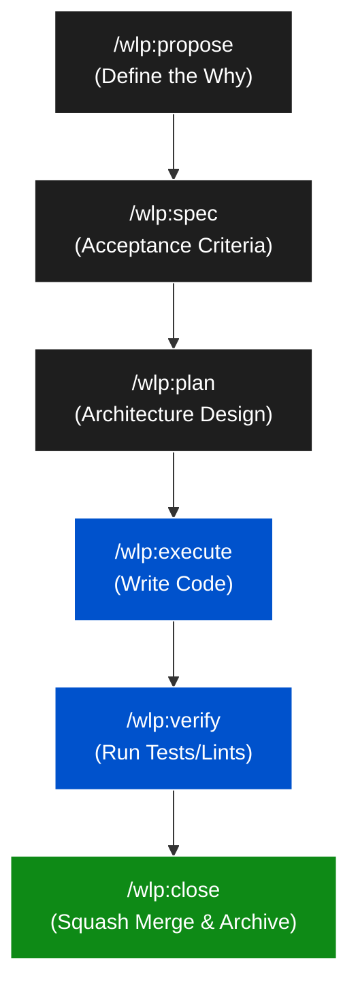

<div align="center">
  <h1>♾️ Workaholoop (WLP)</h1>
  <p><strong>A Spec-Driven State Machine for AI Agents</strong></p>
  <p>Enforces structured coding workflows, parallel worktrees, and seamless GitHub sync for Agentic Software Engineering.</p>

[](https://badge.fury.io/js/@workaholoop%2Fcli)
[](https://opensource.org/licenses/MIT)

</div>

<hr/>

> **"Discipline creates speed."**

The era of "Vibe Coding" is over. When you let AI agents code without a strict plan, they hallucinate, get stuck in infinite retry loops, lose context, and step on each other's toes.

**Workaholoop (WLP)** is an orchestration framework that forces your AI agents (Claude Code, Cursor, Aider) into a disciplined, military-grade development lifecycle. It replaces abstract conversational memory with deterministic, on-disk state machines. **File = State = Truth.**

## 🧭 Philosophy

1. **Spec-Driven**: Every line of code must trace back to a specification. You don't code without an approved spec.
2. **File as State**: If a change folder is in `wlp/changes/active/`, work is in progress. If it's in `wlp/changes/archive/`, it's done. The local filesystem is the single source of truth.
3. **Strict by Default**: You must progress through the phases sequentially: `PROPOSED` → `SPECCED` → `PLANNED` → `ACTIVE` → `VERIFIED` → `CLOSED`.
4. **Deterministic Tracking**: Progress tracking is done via a fast TypeScript CLI—costing zero LLM tokens and eliminating AI hallucination.

## 🌟 Why Choose WLP? (The Killer Features)

- **🔀 Parallel Agent Execution (Git Worktrees):** Run 5 AI agents simultaneously on 5 different features. WLP isolates them into separate `git worktrees`, preventing git conflicts and port collisions.
- **🔄 Zero-Config GitHub Sync:** Bi-directionally sync active features with GitHub Issues. WLP securely and automatically uses your existing `gh auth token` under the hood. No manual setup required.
- **🔌 Harness Agnostic:** A pluggable adapter architecture. Write specs once, execute them with Claude Code, Google Antigravity, OpenCode, Cursor, or Windsurf.
- **⚡ 0-Token State Tracking:** Progress tracking, status summaries, and file validation are powered by a blazing-fast TypeScript CLI—costing you zero LLM tokens.

## 🥊 Ecosystem Comparison

WLP combines the strict orchestration of CCPM with the modular architecture of OpenSpec, and the spec-first mindset of GitHub Spec-Kit:

| Feature                | WLP                     | OpenSpec     | CCPM                    | Spec-Kit       | ECC            |
| :--------------------- | :---------------------- | :----------- | :---------------------- | :------------- | :------------- |
| **Workflow Paradigm**  | Strict Spec-Driven      | Exploratory  | Strict                  | Spec-Driven    | Conversational |
| **Parallel Execution** | Native (`git worktree`) | No           | Native (`git worktree`) | No             | No             |
| **GitHub Sync**        | Auto (Zero-Config `gh`) | Manual       | Manual                  | Native (Cloud) | No             |
| **State Tracking**     | CLI (Instant, 0 tokens) | Prompt-based | Prompt-based            | Cloud Issues   | Prompt-based   |

## 🚀 Installation & Quick Start

Install the CLI globally:

```bash
npm install -g @workaholoop/cli
```

Navigate to your project root and initialize the state machine:

```bash
wlp init
```

_This scaffolds the `wlp/` directory, injects the agent skills, and sets up your IDE harness commands (e.g. for Claude Code, Antigravity, or OpenCode)._

**Your First Feature:**

- **For Claude Code & OpenCode:** Propose a change using the slash command:
  ```text
  /wlp:propose "Add dark mode support to the dashboard"
  ```
- **For Google Antigravity:** Use Natural Language (Intent Routing):
  ```text
  "Wlp propose a change to add dark mode support"
  ```

## 🔄 The Spec-Driven Workflow

Agents are blocked from writing code until the spec is approved. Follow the commands sequentially:



## 💻 CLI Commands Reference

While the AI agent handles the code, the **Deterministic CLI** handles your project management:

| Command              | Description                                                                   |
| :------------------- | :---------------------------------------------------------------------------- |
| `wlp init`           | Scaffolds the workspace and installs harness adapters.                        |
| `wlp status`         | Prints a beautifully formatted table of all active changes and their phases.  |
| `wlp sync`           | Zero-config bi-directional sync with GitHub Issues.                           |
| `wlp standup`        | Generates a daily progress summary by combining active tasks and git commits. |
| `wlp validate`       | Checks your `wlp/` directory for missing files or broken YAML frontmatter.    |
| `wlp search <query>` | Full-text search across all proposals and architectural specs.                |

## 📁 Directory Architecture

```text
my-project/
├── wlp/
│   ├── config.json               # Sync settings & harness details
│   ├── constitution.md           # Your non-negotiable engineering rules
│   ├── changes/
│   │   ├── active/               # Features currently in development
│   │   │   └── add-dark-mode/
│   │   │       ├── proposal.md
│   │   │       ├── specs/
│   │   │       ├── design.md
│   │   │       └── tasks.md      # The Execution Checklist
│   │   └── archive/              # Completed and squashed features
│   └── skills/                   # Agent behavioral instructions
└── src/
```

## 🤝 Contributing & License

We enforce a clean git history. When a feature is completed using `/wlp:close`, the agent will perform a **squash merge**, condensing its messy trial-and-error commits into a single semantic commit.

WLP is MIT Licensed. Pull requests are welcome!
